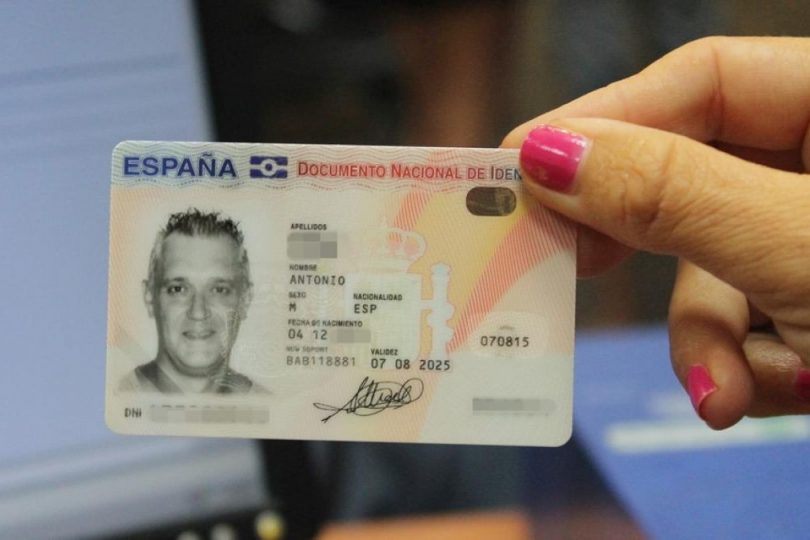
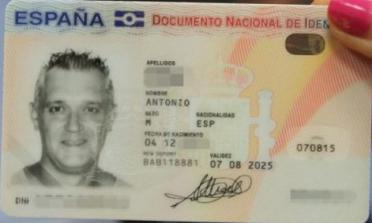

# Endpoint for dni detection

Endpoint that receive an image in base64 encoding and return the card detected in it.
Endpoint created using Flask. To detect edges it's used GaussianBlur, Sobel, Canny and HoughLines.

<p align="center">
  
  
</p>

## Run

Set up your virtual environment and activate it.

 ```bash
python3.6 -m venv venv
source venv/bin/activate
pip install -r requirements.txt
```

Open a terminal and run:

```bash
python app.py
```

You will see something like this:
```
 * Serving Flask app "app" (lazy loading)
 * Environment: production
   WARNING: This is a development server. Do not use it in a production deployment.
   Use a production WSGI server instead.
 * Debug mode: on
 * Running on http://127.0.0.1:1080/ (Press CTRL+C to quit)
 * Restarting with stat
 * Debugger is active!
 * Debugger PIN: 554-067-498
```

## Test

To test the endpoint open a new terminal, activate the environment with:
 ```bash
source venv/bin/activate
```

Once it's activated run:
 ```bash
python test_app.py
```
You will see the output image in data folder as "image_after_endpoint.jpg"


## How it works


## References
